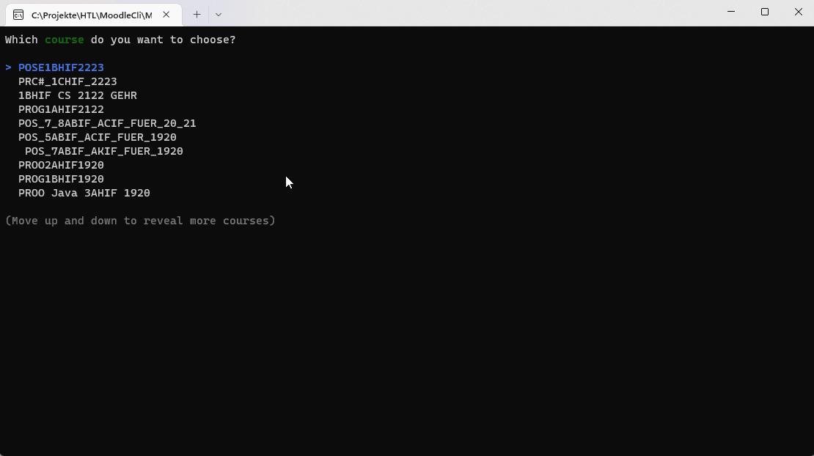

# Moodle CLI

Simple utility to fetch the moodle api.

## Getting started

Define two Environment variables:

 - MOODLE_USER
 - MOODLE_PASSWORD
 
 Start the CLI without any paramters.
 
 ## Status
 
 
