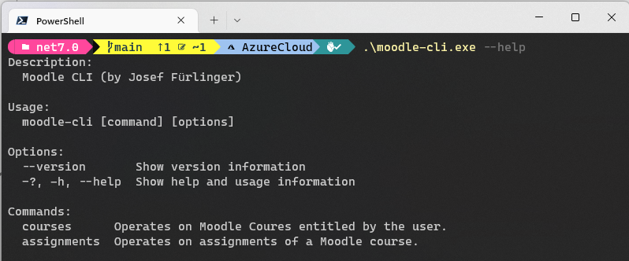
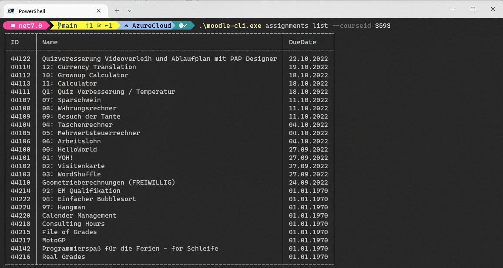

# Moodle CLI

Simple utility to fetch the moodle api.


## Getting started

Define two Environment variables:

 - MOODLE_USER
 - MOODLE_PASSWORD
 
 Start the CLI without any paramters.
 
## Command line behavior

### Help command 

 ```
 moodle-cli --help
 ```



### List assignments command

```
 moodle-cli.exe assignments list --courseid 3593
 ```



 ## Status
 
 [](https://github.com/jfuerlinger/moodle-cli/actions/workflows/build.yml)
